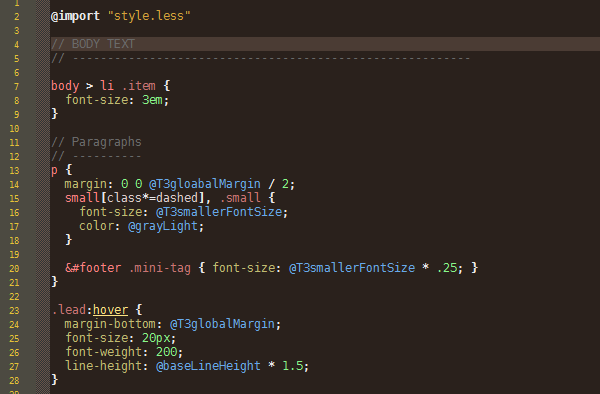
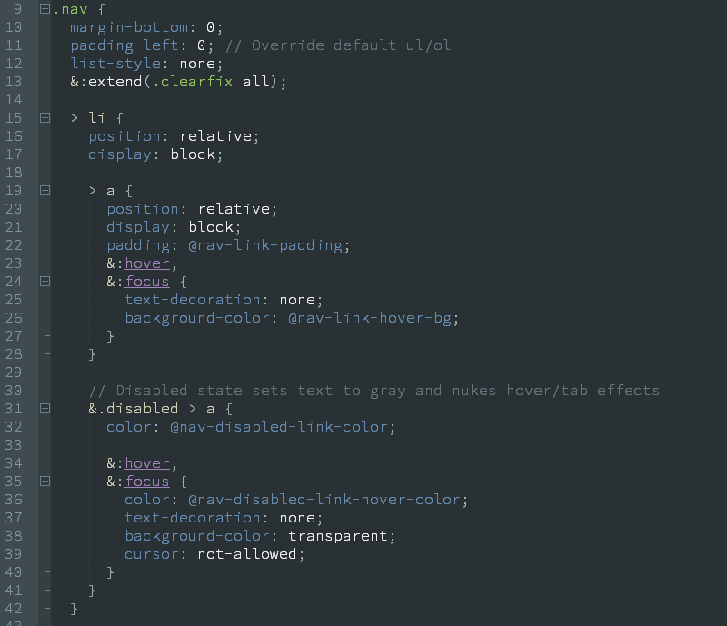

LESS for Notepad++
=========================

Syntax Highlighting for LESS files in Notepad++ (UDL v2.1)

What's This Thing
--------------
Just an xml file that gives you syntax highlighting/coloring for .LESS files inside recent versions of [Notepad++](http://notepad-plus-plus.org) (the ones that support the [User Defined Language](http://udl20.weebly.com/ "User Defined Language")).

How to Use it
--------------
 - Download the `less.xml` file
 - Open Notepad++
 - Go to  `Language -> Define your language...`,  click on  `Import...` and select the `less.xml` file you've downloaded
 - Close and restart Notepad++
 - Done

Notes
-------
The color scheme is purposedly built for the Bespin theme (a dark theme), but changing the background color should be quite easy (it's an xml file in the end;).

Here's a preview of how it looks like:

Obsidian version preview:

Thanks to *Raúl Salitrero* who made the initial version (see [http://sourceforge.net/apps/mediawiki/notepad-plus/?title=User_Defined_Language_Files#L](http://sourceforge.net/apps/mediawiki/notepad-plus/?title=User_Defined_Language_Files#L)).

Use it however you like it. 

Cheers,
azrafe7 (_`azrafe7 at gmail dot com`_)